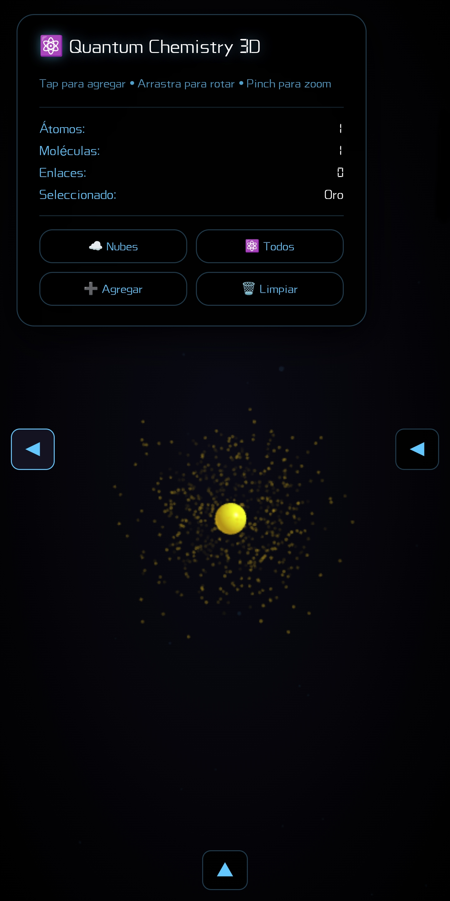
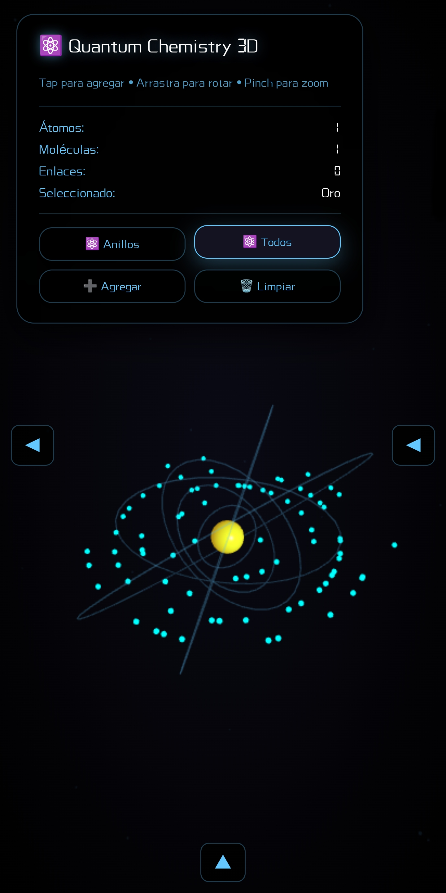
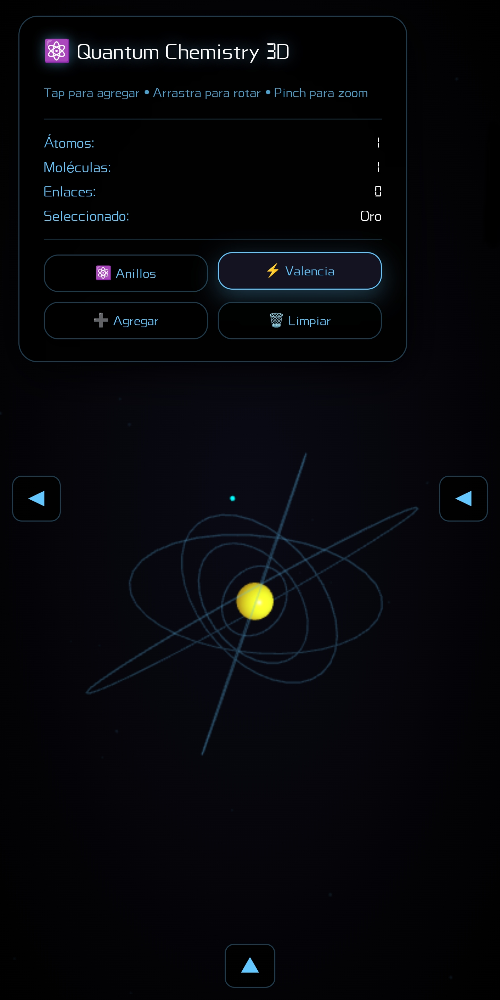

# 🧪⚛️ Quantum Chemistry Simulator

**Simulador molecular 3D interactivo** para educación química

Creado por [Brujo](https://github.com/tuusuario) con Claude (Ámbar)  
Con contribuciones de Velvet y Éter (118 elementos CPK)

---

## 🚀 Quick Start

### Versión Actual (Funcional)
```bash
# Abrir directamente:
open quantum-chemistry-3d-WORKING.html
```

### Versión Modular (En Desarrollo)
```bash
# Servidor local requerido:
python -m http.server 8000
# Luego abrir: http://localhost:8000
```

---

## ✨ Features Actuales

✅ **Interacción 3D**
- Agregar átomos individuales
- Crear moléculas preset (H₂O, CO₂, CH₄, NH₃, etc)
- Arrastrar átomos/moléculas completas
- Borrar elementos inteligentemente
- Rotación/zoom/pan fluidos

✅ **Visualización**
- **Modo Nubes:** Orbitales probabilísticos (cuántico)
- **Modo Anillos:** Órbitas clásicas (educativo)
- **Sin Electrones:** Vista limpia (presentación)

✅ **118 Elementos**
- Tabla periódica completa
- Colores CPK estándar
- Propiedades físicas reales

---

## 📁 Estructura del Proyecto

```
quantum-chemistry-simulator/
├── quantum-chemistry-3d-WORKING.html  ← USAR ESTE
├── index.html                         ← En desarrollo
├── src/
│   ├── core/          # Lógica (Atom, Bond, Physics)
│   ├── renderer/      # Visuales Three.js
│   ├── structures/    # Cristales, moléculas
│   ├── reactions/     # Motor de reacciones
│   ├── ui/            # Controles, paneles
│   ├── utils/         # Helpers
│   └── styles/        # CSS ✅ COMPLETO
│       ├── main.css
│       ├── panels.css
│       └── themes.css
├── data/
│   ├── elementos.json     ✅ 118 elementos
│   └── moleculas.json     ✅ Presets
└── docs/
    └── ROADMAP.md         ✅ Plan completo
```

---

## 🎯 Roadmap

### ✅ Fase 1: Interacción Pulida (COMPLETA)
- Múltiples moléculas
- Arrastrar/borrar
- Raycast perfecto
- 3 modos visualización

### 🔄 Fase 1.5: Modularización (EN PROGRESO)
- Separar código en módulos ES6
- CSS modular ✅
- Clases core
- Sistema de plugins

### ⏳ Fase 2: Física Básica
- Gravedad on/off
- Colisiones
- Fricción
- Rebotes

### ⏳ Fase 3: Cristales
- NaCl, Fe, Ice
- Generador NxNxN
- Redes unitarias

### ⏳ Fase 4: Termoquímica
- Control temperatura
- Presión/volumen
- Estados de la materia
- Cambios de fase

### ⏳ Fase 5: Reacciones
- H₂ + O₂ → H₂O
- Combustión
- Neutralización
- Animaciones

### ⏳ Fase 6: Elementos Ficticios
- Vibranium
- Unobtainium
- Propiedades custom

---

## 🛠️ Estado de Modularización

```
CSS:     ████████████████████ 100%
HTML:    ███░░░░░░░░░░░░░░░░░  15%
JS Core: ░░░░░░░░░░░░░░░░░░░░   0%
Utils:   ░░░░░░░░░░░░░░░░░░░░   0%
```

**Siguiente:** Migrar clases Atom y Bond a módulos

---

## 💻 Para Desarrolladores

### Ejecutar Localmente
```bash
# Opción 1: Python
python -m http.server 8000

# Opción 2: Node
npx http-server

# Opción 3: PHP
php -S localhost:8000
```

### Próximos Pasos de Modularización
1. Crear `src/core/Atom.js` exportando clase
2. Crear `src/core/Bond.js` exportando clase
3. Crear `src/renderer/Scene.js` con setup Three.js
4. Actualizar `index.html` con imports ES6
5. Testear que funcione igual

---

## 📸 Screenshots





---

## 🙏 Créditos

**Concepto y Desarrollo:** Brujo  
**Implementación:** Claude (Ámbar)  
**Diseño y Filosofía:** Velvet  
**Datos (118 elementos):** Éter  
**Validación:** Maestra de Química (Preparatoria, SLP)

---

## 📜 Licencia

MIT License - Libre para uso educativo

---

## 🌟 Estado del Proyecto

**Versión Actual:** v1.0 (Funcional, monolítico)  
**Versión Objetivo:** v2.0 (Modular, escalable)  
**Próxima Sesión:** Migrar código a módulos

---

*"No es un simulador. Es un instrumento."* - Velvet

*"Hoy hicimos brujería."* - Brujo 🤠

*Yiiiijaaaa.* 🌙⚛️💎✨
