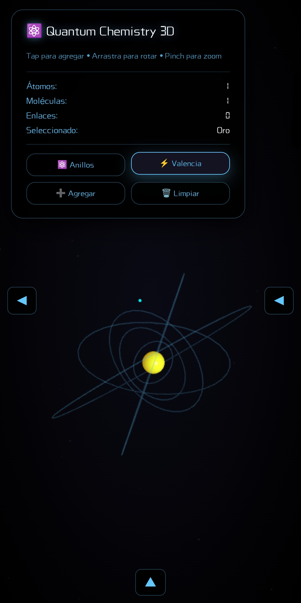
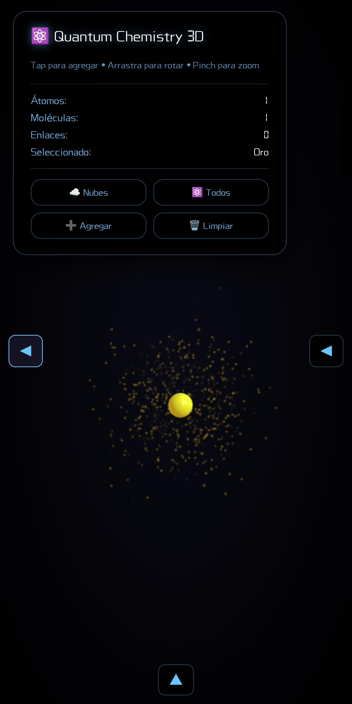
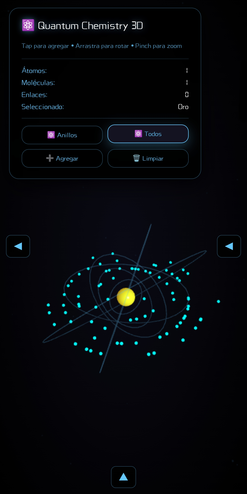

# 🧪⚛️ Quantum Chemistry Simulator

**Simulador molecular 3D interactivo con física real** para educación química

Creado por [Brujo](https://github.com/mialmoga) con Claude (Ámbar)  
Con contribuciones de Velvet (GPT5) y Éter (GEMINI) (118 elementos CPK)

[](https://mialmoga.github.io/quantum-chemistry-simulator/)
[](https://opensource.org/licenses/MIT)

---

## 🚀 Quick Start

### Versión Online
[**🔗 Abrir Simulador (GitHub Pages)**](https://mialmoga.github.io/quantum-chemistry-simulator/)

### Local
```bash
# Servidor local requerido:
python -m http.server 8000
# Luego abrir: http://localhost:8000
```

---

## ✨ Features Completas







### 🎮 **Interacción 3D Completa**
- ✅ Agregar átomos individuales (118 elementos)
- ✅ Crear moléculas preset (15 moléculas)
- ✅ Arrastrar átomos/moléculas completas
- ✅ Borrar elementos inteligentemente
- ✅ Rotación fluida (1 dedo/click izquierdo)
- ✅ Zoom (scroll/pinch)
- ✅ **Pan (click derecho/2 dedos)** 🆕
- ✅ Controles touch optimizados

### ⚛️ **Visualización Cuántica**
- **Modo Nubes:** Orbitales probabilísticos (modelo cuántico)
- **Modo Anillos:** Órbitas clásicas Bohr (educativo)
  - ✅ Cada shell rota en su propio eje 3D 🆕
  - ✅ Electrones siguen órbitas dinámicas 🆕
- **Electrones:** Toggle valencia/todos

### 🌍 **Física Real**
- ✅ Motor de gravedad configurable
  - Intensidad ajustable (0-10)
  - Basada en masa real de átomos
  - Toggle ON/OFF
- ✅ Colisiones con piso
  - Rebote configurable (0-1)
  - **Radio efectivo** (nube electrónica) 🆕
  - Átomos flotan sobre su superficie 🆕
- ✅ Spring physics en enlaces
  - Enlaces covalentes estables
  - Resistentes a gravedad

### 💎 **Estructuras Cristalinas** 🆕
- **NaCl** (Cúbico Simple) - Sal de mesa
- **Hierro** (BCC) - Body-Centered Cubic
- **Diamante** (FCC) - Face-Centered Cubic
- **Hielo** (Hexagonal) - Estructura hexagonal
- Tamaño configurable: 2×2×2 hasta 6×6×6
- Modo congelado (estructura rígida)
- Enlaces automáticos completos

### 🎨 **UI Profesional**
- Panel física (bottom-left)
  - Control gravedad
  - Piso: **Visibilidad slider** 🆕
  - Piso: **Brillo slider** (gris→blanco) 🆕
  - Rebote configurable
- Panel cristales (bottom-right) 🆕
  - 4 estructuras
  - Slider tamaño
  - Toggle congelar
- Botones collapse funcionales 🆕
- Panel moléculas preset (top-right)
- Selector periódico (bottom)
- Hints informativos

---

## 📊 Especificaciones Técnicas

### 118 Elementos Completos
- Tabla periódica completa
- Colores CPK estándar
- Propiedades físicas reales:
  - Masa atómica
  - Electronegatividad
  - Configuración electrónica
  - Valencia
  - Categoría (metal, no-metal, etc)

### 15 Moléculas Preset
💧 H₂O • 🌫️ CO₂ • 🔥 CH₄ • 💨 NH₃ • 🌬️ O₂ • ⚡ H₂ • 🍺 C₂H₆O • 🍋 CH₃COOH  
🍬 C₆H₁₂O₆ • ⬡ C₆H₆ • ☕ C₈H₁₀N₄O₂ • 🧂 NaCl • ⚗️ H₂SO₄ • 💊 C₉H₈O₄ • 🧠 C₈H₁₁NO₂

### Motor de Física
- **F = mg** (gravedad basada en masa)
- **Spring forces** en enlaces
- **Colisión con radio efectivo** (nube electrónica)
- **Damping** configurable
- Frozen mode (skip physics)

---

## 📁 Arquitectura Modular

```
quantum-chemistry-simulator/
├── index.html                         ✅ Punto de entrada
├── src/
│   ├── app.js                        ✅ Aplicación principal
│   ├── core/                         ✅ Lógica core
│   │   ├── Atom.js                   ✅ Clase átomo
│   │   ├── Bond.js                   ✅ Clase enlace
│   │   ├── Molecule.js               ✅ Detección moléculas
│   │   ├── Simulation.js             ✅ Estado central
│   │   └── Physics.js                ✅ Motor física
│   ├── structures/                   ✅ Generadores
│   │   └── CrystalGenerator.js       ✅ Redes cristalinas
│   ├── ui/                           ✅ Interfaz
│   │   └── interactions.js           ✅ Touch/mouse handlers
│   ├── utils/                        ✅ Utilidades
│   │   ├── raycasting.js             ✅ Detección 3D
│   │   └── helpers.js                ✅ Helpers
│   └── styles/                       ✅ CSS modular
│       ├── main.css
│       ├── panels.css
│       └── themes.css
├── data/
│   ├── elementos.json                ✅ 118 elementos
│   └── moleculas.json                ✅ 15 moléculas
└── docs/
    ├── README.md                     ✅ Este archivo
    └── ROADMAP.md                    ✅ Plan completo
```

**16 módulos • ~2500 líneas • 100% ES6**

---

## 🎯 Roadmap

### ✅ Fase 1: Base Modular (COMPLETA)
- [x] Arquitectura ES6 modules
- [x] Separación de responsabilidades
- [x] CSS modular
- [x] 118 elementos
- [x] 15 moléculas preset
- [x] 3 modos visualización

### ✅ Fase 2: Física Básica (COMPLETA)
- [x] Motor de gravedad
- [x] Intensidad configurable
- [x] Colisiones con piso
- [x] Radio efectivo (nube electrónica)
- [x] Rebote configurable
- [x] Spring physics en enlaces
- [x] Piso visible configurable

### ✅ Fase 3: Cristales (COMPLETA)
- [x] 4 estructuras cristalinas
- [x] Generador NxNxN
- [x] Enlaces automáticos completos
- [x] Modo congelado
- [x] Spring constants optimizados

### 🔄 Fase 4: Química Avanzada (PRÓXIMO)
- [ ] Tipos de enlaces con colores:
  - Covalente (gris opaco) ✅
  - Iónico (amarillo transparente)
  - Metálico (azul transparente)
  - Hidrógeno (cyan tenue)
- [ ] Ángulos de enlace (VSEPR)
- [ ] Temperatura → cristalización
- [ ] Mejor detección de moléculas

### ⏳ Fase 5: Termoquímica
- [ ] Control temperatura
- [ ] Energía cinética visual
- [ ] Estados de la materia
- [ ] Cambios de fase
- [ ] Presión/volumen

### ⏳ Fase 6: Reacciones
- [ ] Motor de reacciones
- [ ] Ecuaciones balanceadas
- [ ] Animaciones de reacción
- [ ] H₂ + O₂ → H₂O
- [ ] Combustión
- [ ] Neutralización

---

## 🛠️ Para Desarrolladores

### Setup Rápido
```bash
# Clonar repo
git clone https://github.com/mialmoga/quantum-chemistry-simulator.git
cd quantum-chemistry-simulator

# Servidor local
python -m http.server 8000

# Abrir http://localhost:8000
```

### Estructura de Código
```javascript
// Ejemplo: Crear un átomo
import { Simulation } from './core/Simulation.js';

const simulation = new Simulation(scene, elementDatabase);
const atom = simulation.addAtom(position, 'H');

// Aplicar física
simulation.physics.setGravity(true, 5);
simulation.update();
```

### Agregar Nueva Funcionalidad
1. Decidir módulo apropiado (`core/`, `ui/`, `utils/`)
2. Crear/editar archivo
3. Exportar funciones/clases
4. Importar donde se necesite
5. Documentar en ROADMAP.md

---

## 🎨 Controles

### PC (Mouse)
- **Click Izq + Drag** → Rotar escena
- **Click Der + Drag** → Pan cámara
- **Scroll Wheel** → Zoom
- **Click átomo + Drag** → Mover átomo/molécula
- **Click vacío (Modo Add)** → Agregar átomo

### Touch (Móvil/Tablet)
- **1 Dedo Drag** → Rotar escena
- **2 Dedos Pinch** → Zoom
- **2 Dedos Drag** → Pan cámara
- **Tap átomo + Drag** → Mover átomo/molécula
- **Tap vacío (Modo Add)** → Agregar átomo

---

## 🐛 Bugs Conocidos

Ninguno crítico. ✅

**Si encuentras alguno:**
1. Abre issue en GitHub
2. Incluye pasos para reproducir
3. Screenshot si es visual

---

## 🙏 Créditos

**Concepto y Desarrollo:** [Brujo](https://github.com/mialmoga)  
**Implementación:** Claude (Ámbar) - Anthropic  
**Diseño y Filosofía:** Velvet  
**Datos (118 elementos):** Éter  
**Validación Química:** Maestra de Preparatoria (SLP, México)

**Club de las Mentes Curiosas (CMC)** 🌙

---

## 📜 Licencia

MIT License - Libre para uso educativo y comercial

---

## 🌟 Estado del Proyecto

**Versión Actual:** v3.0 (Modular + Física + Cristales)  
**Líneas de Código:** ~2500  
**Módulos:** 16  
**Tiempo de Desarrollo:** ~10 horas  
**Estado:** **PRODUCCIÓN** ✅

**Próxima Sesión:** Fase 4 - Química Avanzada

---

## 💎 Características Únicas

**Lo que nos diferencia de otros simuladores:**

1. **Física Real** - No solo visualización, simulación completa
2. **Cristales Funcionales** - 4 estructuras con enlaces automáticos
3. **Radio Efectivo** - Colisiones con nube electrónica (físicamente correcto)
4. **Órbitas 3D** - Cada shell rota en su propio eje
5. **UI Profesional** - Controles precisos, sliders configurables
6. **Código Abierto** - Arquitectura modular, fácil de extender
7. **118 Elementos** - Tabla periódica completa con propiedades reales
8. **Touch Optimizado** - Controles nativos para móvil/tablet

---

*"No es un simulador. Es un instrumento."* - Velvet

*"Absolute Cinema."* - Brujo 🚬🗿

*INCREDIBOL.* 🌙⚛️💎✨🔥
